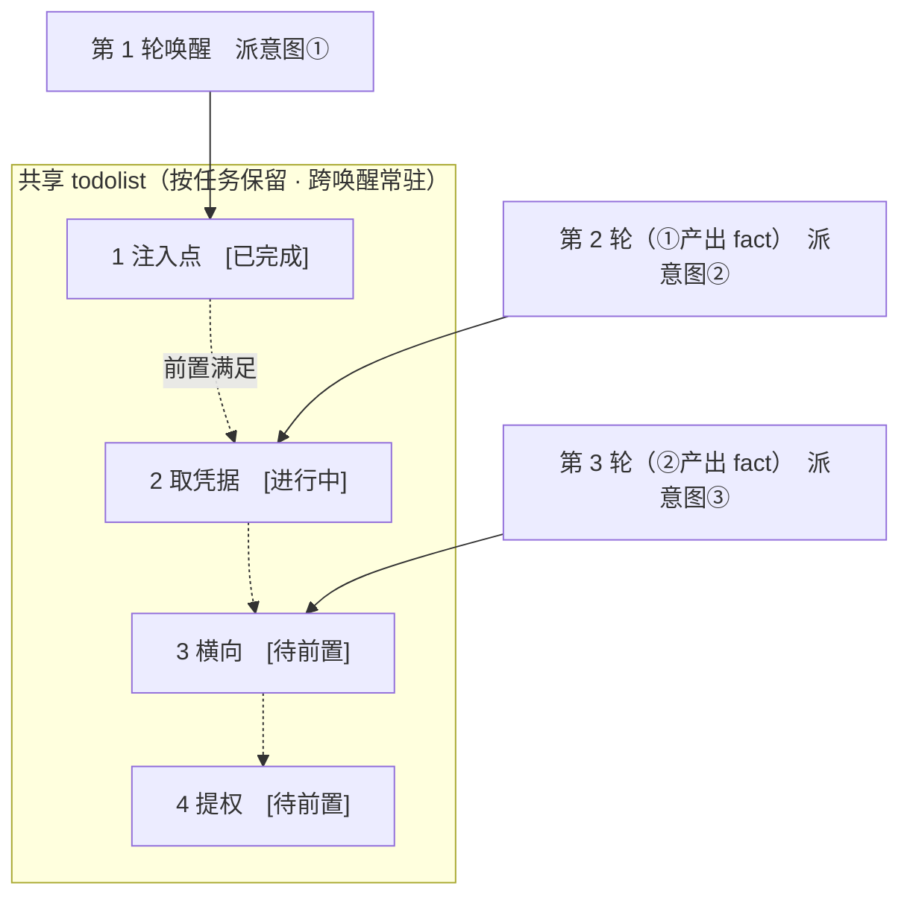

# ARTEX-ymh

AI 自主渗透测试系统 · 二开版（Go 后端 + Next.js 前端 + PostgreSQL)

> 本项目是 [Autumn-27/ARTEX](https://github.com/Autumn-27/ARTEX) 的二次开发分支，基于上游 v0.3.10，持续吸收上游更新（已跟进至 v0.3.12 并选择性吸收 0.3.11/0.3.12 修复），遵循上游 **AGPL-3.0** 协议（见 `LICENSE`)。
> 二开方向：把上游「外网自动化探索平台」扩展为「**外网突破 → 立足点 → 内网纵深**」的全流程自主渗透平台，并补齐实战化安全与稳定性短板。
> 🌐 **在线 Demo**：[https://artex-demo.vercel.app/](https://artex-demo.vercel.app/)

---

## 与上游的主要区别

| 子系统 | 内容 |
| --- | --- |
| **内网作战** | webshell 加密会话管理（PHP/JSP)、反弹 shell(penelope 受管）、立足点被动侦察（`session_recon`)、多层代理隧道（suo5/chisel 自动选型、任务级 MITM 热切换）、内网拓扑图（按 /24 网段分框、按主机聚合、服务自主机点展开，**红=已拿下 / 绿=未拿下**）、凭据库 |
| **阶段编排** | 待授权网段审批（侦察发现 scope 外网段 → 人工批准扩 scope)、外网→内网任务移交（handoff 模板建子任务）、内网 worker 提示词变体（有立足点自动切换） |
| **安全与反测绘** | 伪装门控（未过门控一律返回逐字节固定 nginx 欢迎页，随机入口路径）、一键放行（2/4/8h 时限审批豁免，deny 不豁免）、RoE 范围强制三态（off/warn/strict) |
| **蜜罐识别与反 AI 蜜罐防护** | 静态签名识别层（`honeydetect/`，内嵌签名库覆盖 Cowrie/OpenCanary/Kippo/Glastopf/HFish/Dionaea)、资产蜜罐评分与 UI 徽标、planner 处置纪律；针对"以 AI 攻击代理为猎物"的新型陷阱：worker 红线（永不自证）、出口敏感信息拦截、tarpit 抓取熔断、UA 池。设计见 `HONEYPOT-DETECTION-DESIGN.md` |
| **chains 场景化** | 九类反问思维链骨架按意图自动注入、按漏洞类别的反证判据（误报写 fact、真漏洞才落图）、类别化转向提示 |
| **武器库与部署链** | 17 项外部工具钉版清单（`packaging/tools-manifest.json`，启动自检 sha256)、`artex doctor` 部署预检、systemd unit |
| **稳定性** | 任务 deadline 冻结感知（宿主机睡眠不烧任务）、LLM 调用硬墙钟、会话探活与启动卫生 |
| **漏洞二次审核** | 新建任务时可开启；AI 按**企业 SRC / EduSRC** 收录标准复核每条 finding，规则层兜底（如 CORS 误配等对面不收的类别直接忽略）+ 审核失败冷却 + 判重，不符合收录标准自动标记「忽略」并注明原因 |
| **漏洞去重** | 四层去重：写入扩展键 → DB 兜底查重 → 审核阶段语义判重 → 人工合并，解决同一漏洞重复上报 |
| **任务模板** | 内置 **CTF** / **SRC** 两套模板，建任务时可选；SRC 模板明确边界，强调不得越界深入利用 |
| **任务管理** | 删除任务时可选一并清理内网模块（会话 / 隧道 / 凭据） |

详细二开说明见 `README-FORK.md`；分布式演进评估见 `FUTURE.md`。

---

## 截图预览

> 完整交互见[在线 Demo](https://artex-demo.vercel.app/)。

| 仪表盘（总览 / Token 消耗 / 活动流） | 任务列表 |
| :---: | :---: |
|  |  |

| 任务 · 执行过程（会话 / 工具调用） | 探索链路 |
| :---: | :---: |
|  |  |

| 发现 | 资产 |
| :---: | :---: |
|  |  |

| 资产覆盖图（力导向布局 · 已测高亮 · 节点折叠展开） |
| :---: |
|  |

| 流量录制 | 人在环路对话 |
| :---: | :---: |
|  |  |

| Agent 管理 | LLM 配置 |
| :---: | :---: |
|  |  |

| 拦截审批 | 后端日志 |
| :---: | :---: |
|  |  |


---

## 审批记录详情

全局「审批记录」、任务内「拦截审批」及对话中的审批卡片均支持展开查看详情。展示结构参考
[AegisHook 的审批详情组件](https://github.com/RuoJi6/AegisHook/blob/main/web/src/components/CallDetail.vue)，沿用 ARTEX 的组件和主题：


## 资产同步（ScopeSentry）

支持从 [ScopeSentry](https://github.com/Autumn-27/ScopeSentry) 直接同步资产数据，免去重复收集：

- 在「**资产同步**」页填 ScopeSentry 的地址与 API Key，接入数据源；
- 按**项目**或**任务**维度选择要同步的目标与资产类型（域名 / 子域 / IP / 端口 / 站点 / 端点…）；
- 一键导入并按公司资产范围归并，直接进入 ARTEX 的资产图供 agent 探索使用。

---

## 安装

> 依赖 **PostgreSQL**;探索需配置 **LLM**（兼容 OpenAI/Anthropic 协议，可在 UI 里配）。

### 方式一：一键安装脚本

```bash
git clone https://github.com/r0th-m/artex-ymh.git
cd artex-ymh
./install.sh
```

脚本会检测/自动安装 Docker，可选 **① 全部 Docker** 或 **② 本地编译运行**（生成 `config.json` 并编译内嵌单二进制）。装好后打开 `http://localhost:8787`。

### 方式二：从源码编译单二进制

> 前置要求：Go ≥ 1.26、Node ≥ 20（前端构建内存建议 ≥ 4G)。
> **老发行版注意**:Node ≥ 18 官方构建要求 glibc ≥ 2.28,Ubuntu 18.04(glibc 2.27）无法运行——需用 [unofficial-builds 的 glibc-217 构建](https://unofficial-builds.nodejs.org/download/release/)或换更新的系统。
> **国内网络**：克隆 GitHub、npm、Go 模块可能需要代理/镜像，参考：`git config --global http.proxy socks5h://127.0.0.1:7890`、`npm config set registry https://registry.npmmirror.com`、`go env -w GOPROXY=https://goproxy.cn,direct`。

```bash
git clone https://github.com/r0th-m/artex-ymh.git
cd artex-ymh
# 1) 前端静态导出
cd web && npm ci && npm run build:static && cd ..
# 2) 拷进内嵌目录(全新克隆下若报目录不存在,先 mkdir -p server/webui/dist)
cp -r web/out server/webui/dist
# 3) 编译(-tags embedui 才内嵌前端)
CGO_ENABLED=0 go build -tags embedui -o artex ./cmd/artex
# 4) 配置数据库连接(必须,否则起不来)
cp config.example.json config.json   # 编辑填好 database 段
./start.sh
```

### 方式三：systemd 托管（Linux 服务器推荐）

```bash
sudo install -m644 packaging/artex.service /etc/systemd/system/artex.service
# 编辑 unit:User= / WorkingDirectory= / ExecStart= 改成你的部署账号与安装目录
sudo systemctl daemon-reload && sudo systemctl enable --now artex
journalctl -u artex -f
```

可选环境变量（如 `ARTEX_CALLBACK_ADDR` 回连地址）写在 `/etc/artex.env`。

### 方式四：Docker

仓库的 `docker-compose.yml` 已配置为**从源码构建二开版镜像**(`Dockerfile.source`：前端构建 → Go 编译 → 工具运行时，全部在 Docker 内完成，宿主无需 Go/Node):

```bash
git clone https://github.com/r0th-m/artex-ymh.git
cd artex-ymh
cp .env.example .env   # 填 POSTGRES_PASSWORD(不要用 # 字符)
docker compose up -d --build
```

⚠️ 不要把这个 compose 的镜像改成 `autumn27/artex`——那是**上游原版**，不含二开代码（2026-09 实测踩坑：照抄上游 compose 部署会得到原版）。
⚠️ 构建需要访问 apt/npm/Go 模块源，国内机器请先给 Docker 配代理（`~/.docker/config.json` 的 proxies 段）或镜像站。

---

## 首次使用（重要）

二开版默认开启**反测绘伪装门控**：非 loopback 监听时，直接访问 `http://<IP>:8787` 看到的是 nginx 欢迎页（正常现象）。

1. 启动日志会打印入口路径，形如 `[gate] 伪装门控已启用,入口路径: /g-xxxxxxxx`（也写入 `data/gate.path`);
2. 浏览器访问 `http://<IP>:8787/g-xxxxxxxx`，输入门控口令（默认同入口路径随机串）;
3. 首次进入 `/setup` 设置管理员密码。

> - 门控 cookie 由 `gate.key` 签名，该文件默认不在 `data/` 下：**换二进制或重建容器会重新生成 key，旧 cookie 失效**，重输一次口令即可；入口路径存在 `data/gate.path`，重启不会变。
> - `8788` 是内置流量代理口（直连返回 `407 Proxy Authentication Required` 属正常），前端端口是 `8787`。
> - 页面提示 **「前端未内嵌到此二进制」** 时，是编译漏了 `-tags embedui`（见「方式二」第 3 步）。

## 外部工具（军火库）与部署自检

渗透能力依赖一批外部工具，统一放 **`data/tools/`**:

| 工具 | 用途 |
| --- | --- |
| suo5 / chisel / ligolo | 隧道与多层代理（目标无出网/能出网/TUN 组网） |
| gogo / naabu / httpx / katana / fscan | 端口扫描、HTTP 探测、爬虫、内网综合扫描 |
| impacket / nxc / mimikatz / pypykatz / laZagne | Windows 协议利用与凭据收割 |
| peass / penelope | 提权枚举 / 反弹 shell handler |

- **钉版清单**:`packaging/tools-manifest.json` 记录版本/平台/sha256/相对路径，启动自检（不匹配只警告，留空=未钉）。
- **部署预检**：装完/升级后跑 `./artex doctor`——检查 PG、LLM profile、data 可写、隧道工具、军火库、门控、回连地址，FAIL 退出码 1。
- 工具在「工具」页注册为自定义工具（`kind=shell`）后 agent 才能调用。

### CTF 工具箱（misc / RE / pwn）

镜像内置一层 CTF 常用件（`packaging/ctf-tools.sh`，根 `Dockerfile` / `Dockerfile.source` / 二开 `Dockerfile.fork` 共用同一份清单）：

| 分类 | 工具 |
| --- | --- |
| misc / 取证 | file、xxd、binwalk、foremost、sleuthkit、testdisk、steghide、outguess、pngcheck、exiftool、zbar、poppler、qpdf、pdfcrack、fcrackzip、7z、hashcat、john、tshark、tcpdump、ffmpeg、sox、imagemagick、sqlite3、gawk、netcat、unar、tesseract-ocr |
| RE | binutils（objdump/readelf/strings/nm）、gdb、gdb-multiarch、strace、ltrace、nasm、patchelf；pip：capstone、keystone-engine、unicorn、z3-solver、sympy |
| pwn | build-essential、qemu-user、qemu-user-static、patchelf；pip：pwntools、ROPgadget、ropper、pyelftools、lief；gem：one_gadget、seccomp-tools（Ruby 3.1 环境自动钉 1.6.1）、zsteg |
| 可选（`CTF_EXTRA=1`） | radare2 6.2.4、upx 5.2.1（bookworm 无 apt 候选包，走 GitHub 钉版 + sha256 校验，校验不过自动跳过，不中断构建）、angr（pip 符号执行） |

- 构建参数（默认官方源，国内构建建议传）：`APT_MIRROR` / `PIP_MIRROR` / `GEM_SOURCE` / `CTF_EXTRA` / `GH_PROXY`，compose 读同名环境变量，如 `APT_MIRROR=mirrors.tuna.tsinghua.edu.cn PIP_MIRROR=https://mirrors.aliyun.com/pypi/simple CTF_EXTRA=1 docker compose build`。
- Agent 侧无需注册：这些是 CLI 与 Python/gem 库，Bash 工具直接可调；`skills/ctf-toolbox/` 提供「什么时候用哪个」的选型索引。

## 升级

- **重启即迁移**:schema 每次启动幂等重跑，升级只换程序不动数据（备份 `./data` 与数据库仍是好习惯）。
- ⚠️ **不要用页面「一键更新」**：它指向**上游** release 源，会把二开版覆盖成上游原版。升级二开版请用 `git pull` + 重新编译（方式二）。

## 配置

**数据库**(`config.json`，或环境变量 `ARTEX_PG_DSN` 覆盖）:

```json
{
  "database": {
    "host": "127.0.0.1", "port": 5432,
    "user": "artex", "password": "yourpass",
    "dbname": "artex", "sslmode": "disable"
  }
}
```

**LLM**：`export ANTHROPIC_API_KEY=sk-...`（或 `OPENAI_API_KEY`），也可在 UI 的「LLM 配置」页填写。
可选：`ARTEX_LLM_PROVIDER` / `ARTEX_LLM_MODEL` / `ARTEX_LLM_BASE_URL` / `ARTEX_LLM_PROXY`。

**并发**：每个任务的 work agent 数在「系统设置」里配置（默认 3）。

**常用参数**：`./start.sh -addr :8787 -proxy :8788`（`-addr` 前端+API，`-proxy` 流量录制代理）。启动脚本会把参数原样透传给 `artex`。

### 反向代理部署（HTTPS / 只开放 443）

前端和 API/SSE 都由同一个后端端口（默认 `:8787`）提供，实时活动流默认走**同源**地址，因此**无需配置 `NEXT_PUBLIC_SSE_BASE`**，公网只开放 443、把 8787 留在内网即可。

SSE 是长连接 + 持续推送，反代**必须关闭缓冲**，否则浏览器能连上却收不到事件（表现为活动流一直转圈）。Nginx 示例：

```nginx
server {
    listen 443 ssl;
    server_name your.domain.com;
    # ssl_certificate / ssl_certificate_key ...

    location / {
        proxy_pass http://127.0.0.1:8787;
        proxy_set_header Host $host;
        proxy_set_header X-Forwarded-Proto $scheme;

        # SSE 关键项：关缓冲、长超时、HTTP/1.1
        proxy_buffering off;
        proxy_cache off;
        proxy_read_timeout 3600s;
        proxy_http_version 1.1;
        proxy_set_header Connection "";
    }
}
```

> 仅当 SSE 需要走与页面不同的来源（如独立子域）时，才在**构建期**设置 `NEXT_PUBLIC_SSE_BASE`（该变量在 `next build` 时固化进静态包，容器运行时再设无效）。

---


## 开发

### 手动漏洞复测

任务详情的「复测」页签可分页选择本任务的漏洞、查看历次结论和证据，并手动发起复测。启动后保留当前页签，显示转圈图标和「复测中」；确认修复后同步更新漏洞状态。

在漏洞列表每行操作区点击「复测」，或在漏洞详情的「漏洞复测」区域点击「发起复测」，填写可选的修复版本、测试条件或限制，系统会创建独立的复测 Agent 会话，启动后保留当前页面。列表的平铺、按任务分组和资产视图均支持该入口；复测运行时显示转圈图标和「复测中」，需要查看时点击进入对应会话，结束后恢复「复测」。复测无需重新启动原扫描任务，结论分为「仍可复现」「已修复」「无法确认」，每次的结论、证据和会话链接保存在漏洞详情中。

新版后端首次启动会预置可编辑的「漏洞复测」（`retester`）Agent，可在 Agent 管理中配置提示词、LLM、运行预算和工具。默认使用其绑定的 LLM，未绑定则使用全局激活配置。复测会话成功完成且结论为「已修复」时，系统自动将漏洞处置状态改为「已修复」；执行中、失败、停止或其他结论保留原状态。原始证据和报告始终保留。也可在状态下拉菜单中手动选择「已修复」。同一漏洞正在复测时复用已有会话，停止、失败或服务重启后可重新发起。

本版历史记录通过漏洞详情和会话查看，暂未纳入漏洞报告导出或任务归档包，也未自动关联流量包。演示模式只生成明确标注的模拟记录，不请求真实目标。

### 本地运行与测试

```bash
./dev.sh    # 后端(:8787) + 流量代理(:8788) + 前端 next dev(:5173) → http://localhost:5173
```

- 后端：`go run ./cmd/artex`（不带 `-tags embedui` 则不内嵌前端）
- 前端：`cd web && npm run dev`（`/api` 反代到后端，带热更新）
- 测试：`go test ./...`
- Mock 预览（无后端）：`cd web && NEXT_PUBLIC_MOCK=1 npm run dev`

---

## 系统技术架构

ARTEX 是一套 **LLM 多 agent 驱动的自主渗透系统**:Go 单体后端（内嵌 Next.js 前端）+ PostgreSQL,agent 能力由 [`norma`](https://github.com/Autumn-27/norma) SDK 提供。核心是**双图架构**:

- **资产图（全局共享）**：跨任务的资产真值库，节点为 root_domain/subdomain/ip/service/app/endpoint，归属公司；域名→子域→服务→端点的父子关系由程序计算，agent 只提交原始信息。
- **探索图（每任务独立）**：一次任务的"思考与推进"过程，节点为 goal/intent/fact/finding/hint，靠 spawns/derived_from/yields/proves 边连成血缘链；经锚点（`exploration_anchors`）与资产图相连，支撑资产测试覆盖度。
- **引擎是事件驱动闭环**：图一变就唤醒 planner → planner 读态势派意图 → worker 领一条意图、用真实工具执行、把新资产/事实/漏洞写回两图 → 再唤醒。worker 间有过程级信息交换（`search_all_worker_traces`);planner 持跨唤醒共享 todolist 稳定多步攻击链。

二开在此基础上增加：会话/隧道/移交的内网作战层、待授权网段审批链、蜜罐置信度数据线（识别+防护）、chains 场景化激活。详见各设计文档。

## 文档索引

| 文档 | 内容 |
| --- | --- |
| `README-FORK.md` | 二开完整说明（与上游关系、新增能力清单、验证情况） |
| `FUTURE.md` | 分布式改造全面评估（server 大脑 + 远程 node 执行） |
| `HONEYPOT-DETECTION-DESIGN.md` | 蜜罐识别模块调研与设计（含反 AI 代理蜜罐） |
| `INTRANET-PIVOT-DESIGN.md` | 内网作战子系统设计 |
| `CHAINS-INTEGRATION-DESIGN.md` | chains 场景化激活设计 |
| `POSTMORTEM-RED-SUN-3.md` / `AB-REPORT-RED-SUN-3.md` | 红日靶场 3 实战复盘 |

## 许可与免责声明

### 开源协议

本项目采用 **GNU Affero General Public License v3.0（AGPL-3.0）** 授权，完整条款见仓库根目录的 [LICENSE](LICENSE) 文件。

这意味着任何人都可以自由使用、修改和分发本项目，但**衍生作品必须同样以 AGPL-3.0 开源**；特别地，**若你修改本项目并通过网络（如部署为在线服务）向用户提供，也必须向这些用户公开对应的完整源码**（给出本仓库链接即可满足）。

> ⚠️ **重要提示**：开源协议本身不限制软件的使用用途。以下的「使用限制」与「免责声明」是对使用者的额外约定与郑重声明，请务必遵守。

**本项目仅供个人学习、代码研究与本地技术验证使用，不得用于对任何线上系统或网站发起实际测试。**

### 允许使用范围

- 仅可用于**阅读、学习与研究本项目源码**，以及在**本地隔离环境**（自建靶场、授权明确的实验环境）中进行技术原理验证；
- 适用于个人学习、学术研究、代码审阅等非攻击性用途。

### 禁止事项

- **严禁使用本工具对任何网站、线上服务或联网系统发起扫描、探测、利用或攻击**（无论是否获得授权、是否为自有资产）;
- 严禁将本工具用于任何实际的渗透测试、攻防对抗或生产环境；
- 严禁将本工具用于非法入侵、数据窃取、勒索、拒绝服务或任何破坏性、犯罪性活动；
- 严禁利用本工具从事违反所在国家/地区法律法规的行为。

### 合规责任

使用者须自行遵守所在国家/地区关于网络安全、数据保护与计算机犯罪的全部法律法规（在中国大陆包括但不限于《网络安全法》《数据安全法》《个人信息保护法》及相关司法解释）。**因使用本工具产生的一切法律责任与后果，均由使用者自行承担。**

### 免责声明

本项目按"现状"提供，不附带任何明示或默示的担保（包括但不限于适销性、特定用途适用性与不侵权的担保）。在任何情况下，原作者与二开维护者均不对因使用或无法使用本项目而产生的任何直接、间接、附带、特殊、惩罚性或后果性损害（包括但不限于数据丢失、业务中断、系统受损、名誉损失或任何法律责任）承担责任，即使已被告知此类损害的可能性。

### planner 多轮共享 todolist → 稳定的攻击链路

真实攻击链往往是**有前后依赖的多步序列**（如：发现注入点 → 拿到凭据 → 横向 → 提权），一次性把这些并行派下去只会乱套。planner 因此持有一份**按任务保留、跨唤醒共享的规划待办（todolist）**：

- planner 是事件驱动的——图一变就被唤醒，但**每次唤醒是全新会话**；共享的 todolist 让它把一条串行利用链**记录一次**、然后在后续多轮里**按依赖逐步派意图**，而不是把整条链在一轮里全部前置展开；
- 每轮只对「前置步骤已完成、其依赖的 fact 已存在」的下一步派意图，并随进展更新清单（把已被 fact 满足的步骤标完成）。



于是攻击链在“事件驱动 + 无状态会话”的环境下依然**稳定推进、不重复、不错序**——这是 ARTEX 能自主走完多步利用链的关键。

---

## 交流群

扫码关注微信公众号 **SecSentry**，在公众号后台私信即可入群交流。

<div align="center">


</div>

---
## 参考

https://github.com/oritera/Cairn


## 许可与免责声明

### 开源协议

本项目采用 **GNU Affero General Public License v3.0（AGPL-3.0）** 授权，完整条款见仓库根目录的 [LICENSE](LICENSE) 文件。

这意味着任何人都可以自由使用、修改和分发本项目，但**衍生作品必须同样以 AGPL-3.0 开源**；特别地，**若你修改本项目并通过网络（如部署为在线服务）向用户提供，也必须向这些用户公开对应的完整源码**。

> ⚠️ **重要提示**：开源协议本身不限制软件的使用用途。以下的「使用限制」与「免责声明」是作者对使用者的额外约定与郑重声明，请务必遵守。

**ARTEX 仅供个人学习、代码研究与本地技术验证使用，不得用于对任何线上系统或网站发起实际测试。**

### 允许使用范围

- 仅可用于**阅读、学习与研究本项目源码**，以及在**本地隔离环境**中进行技术原理验证；
- 适用于个人学习、学术研究、代码审阅等非攻击性用途。

### 禁止事项

- **严禁使用本工具对任何网站、线上服务或联网系统发起扫描、探测、利用或攻击**（无论是否获得授权、是否为自有资产）；
- 严禁将本工具用于任何实际的渗透测试、攻防对抗或生产环境；
- 严禁将本工具用于非法入侵、数据窃取、勒索、拒绝服务或任何破坏性、犯罪性活动；
- 严禁利用本工具从事违反所在国家/地区法律法规的行为。

### 合规责任

使用者须自行遵守所在国家/地区关于网络安全、数据保护与计算机犯罪的全部法律法规（在中国大陆包括但不限于《网络安全法》《数据安全法》《个人信息保护法》及相关司法解释）。**因使用本工具产生的一切法律责任与后果，均由使用者自行承担。**

### 免责声明

本项目按“现状（AS IS）”提供，不附带任何明示或默示的担保。作者及贡献者不对使用本工具（无论使用方式是否得当）所导致的任何直接或间接损失、数据丢失、系统损坏或法律纠纷承担责任。**下载、安装或使用本项目，即表示你已阅读、理解并同意上述全部条款。**
